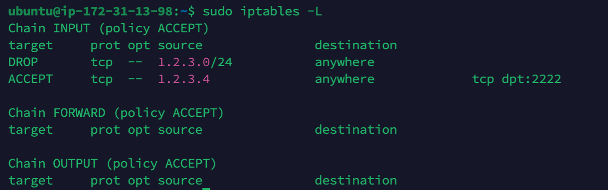
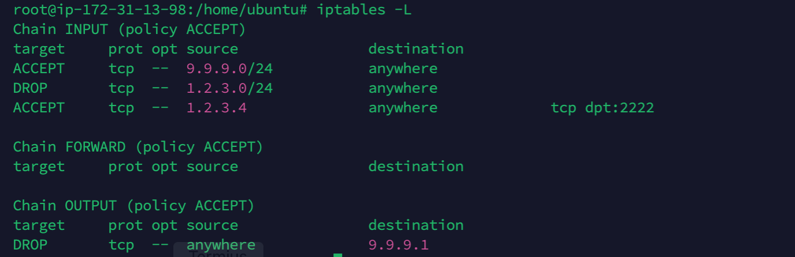

# iptables理论详解

iptables主要由规则(Rule)，链(Clain)，和表(Table)组成。他们三者的关系相对简单：

1. Rule: 定义一个包含条件和动作的规则，当满足什么条件时，做什么；
2. Clain: 零个、一个或多个Rules的链表结构，按照链表的顺序，报文会被Rule进行处理；
3. Table: 多个Clain的集合。

接下来自下而上地依次讲解三个部分。

## 规则（Rules）

一个规则可以简单包括两个部分：“是不是”，“如果是的话干什么”。

### 条件（是不是）
假设我们自己就是iptables，我们现在拿到了一个IPv4报文，我们就可以看到这个报文的所有信息，然后验证这个报文是否满足该条件。

例如：这个报文是不是来自于IP段1.2.3.0/24的？这个报文是不是一个TCP报文？

请重新查看下图，Iptable可以判断下图的所有条件：


此外，iptables还可以判断这个报文是不是来自某个网卡，典型的网卡例子有:
1. `lo`: LoopBack，回环地址127.0.0.1；
2. `eth0,eth1`: 以太网网卡，也就是连外部网络的；
3. `docker0`: Docker自己创建的虚拟网卡等。

在这里插一句，对Linux而言，一切皆文件，网卡也不例外。只要有相应的驱动能够识别到这个网卡，此时，这个网卡就是一个简单的`FILE*`，可以`open(2)`，`write(2)`, `read(2)`，与普通的文本文件向磁盘写入字节稍微不同的是，`write(2)`代表向网卡写入字节，`read(2)`代表从网卡中读出字节，而这个字节一般都是网络报文的数据。

### 目标（如果达成了条件，则干什么）
当iptables匹配到了该报文对该Rule的条件成立，那么就会执行该规则的目标(**Target**)。这些目标可以是：
1. ACCEPT： 接受，即允许数据包正常通过；
2. DROP：丢弃数据包而没有任何响应；
3. REJECT：拒绝该数据包，但是必要时会返回详细信息给源；
4. 转到用户定义的Clain中继续判定；
5. 其他被`iptables-extensions(8)`所定义的目标。

前面三个目标比较显而易懂，第四个目标我们暂时不做考虑，后面学习到Clain再做讲解。第五个目标是`iptables-extensions`，这类属于对iptables的拓展内容，不做深入的讲解。

### 使用一些例子来介绍规则
下面我将会使用一些简单的例子来做说明：

1. `DROP`来源IP段为`1.2.3.0/24`的TCP报文

```
iptables -A INPUT \
    -p tcp -s 1.2.3.0/24 -j DROP
```

> 第一行暂时跳过，我们从第二行开始。

首先，`-p`参数指明`Protocal`为TCP协议；`-s`指明`Source`，可以是IP段或IP地址，`-j`表示Target，这里是`DROP`.

当然，如果也可以使用`REJECT`。

2. `ACCEPT`来源IP为`1.2.3.4`的ssh报文，端口为2222。

```
iptables -A INPUT \
    -p tcp -s 1.2.3.4 --dport 2222 -j ACCEPT
```

与第一个例子不同的是，使用`--dport`参数表明**目标端口**，注意这个**目标**其实就是当前主机。

## 链(Clains)

Rules是独立的，我们需要使用一种数据结构将独立的、离散的Rules组合起来。

Clain本质上是一个包含Rules的链表，这种Clain有五种：
1. INPUT链：处理来自外部的数据。我们在上一小节中就是用的这个作为例子。(`-A INPUT`，表示往`INPUT`追加规则)；
2. OUTPUT链：处理从内部发往外部的数据。
3. FORWARD链：将数据从一个网卡转发到其他的网卡上，以将这个数据包交付给本身或其他主机(主机和主机之间就是通过局域网的网卡通信)；
4. PREROUTING链：当报文到达时，尝试修改报文；
5. POSTROUTING链：当报文即将离开时，尝试修改报文。

此外，我们可以自定义链(`Custom Clains`)。自定义链可以理解成是一个我们自己写的函数，把所有规则放在一起，方便复用和更好地组织结构。

先来考虑两个比较简单的链：`INPUT`, `OUTPUT`。这两个链都比较直观，分别(直观地)控制入站流量和出站流量。而其他链路此时只需要了解即可。

### Rules在Clain中的表现

我们不妨执行上一节中的两条命令：
```
iptables -A INPUT -p tcp -s 1.2.3.0/24 -j DROP
iptables -A INPUT -p tcp -s 1.2.3.4 --dport 2222 -j ACCEPT
```

然后使用下面的命令：
```
iptables -L 
```

你可以看到类似下图的结果：


目前我们无需关注其他内容，请看到`Clain INPUT`.

可以发现，两条Rule就按照添加的顺序列在下面。从上到下，代表的就是链表的从头到尾的顺序。在链表末尾有一个“默认目标”，也就是`ACCEPT` (由`policy ACCEPT`指定)。如下图所示：

```
TODO: add a graph
```

#### 例子1

现在假设源IP为`1.2.3.88`的主机以HTTP/TCP协议访问本机器的`8080`端口，请问可以放行吗？

> 答：不可以。第一条规则规定，来自于`1.2.3.0/24`域的所有流量都会被`DROP`。且由于是`DROP`，甚至不会返回“为什么无法连接”的错误信息。

#### 例子2

可以看到规则2指明，`1.2.3.4`可以用TCP协议访问`22`端口。那么源IP为`1.2.3.4`尝试ssh连接`22`端口可行吗？

> 答：不可以。虽然规则2允许，但是请注意这是一个链表。规则1会被先匹配成功，然后`DROP`.

#### 例子3

源IP`8.8.8.8`可以访问本机的443端口吗？

> 答：可以。由于不匹配所有规则，因此命中了Clain的默认规则：`ACCEPT`.

请注意，以上的所有例子都是只针对`INPUT`链的。如果报文能进入(被`INPUT` `ACCEPT`了)，但是没法出去(没有被`OUTPUT ACCEPT`)，通信也没法完成。

那么Clains之间是怎么配合的呢，就涉及到我们接下来要讲解的内容：表(Table)

## 表(Tables)

Table是一个Clains的集合。在iptables中，表是有优先级的（报文先被那个表处理），每个表都有自己的默认Clains。按照优先级顺序，列举如下：
1. Raw表：处理状态跟踪（用得少）；
   1. OUTPUT链；
   2. PREROUTING链；
2. Mangle表：修改TTL等信息（用得少）；
   1. PREROUTING链；
   2. POSTROUTING链；
   3. INPUT链；
   4. OUTPUT链；
   5. FORWARD链；
3. NAT表：用作地址转换；
   1. PREROUTING链；
   2. POSTROUTING链；
   3. OUTPUT链；
4. Filter表：
   1. INPUT链；
   2. FORWARD链；
   3. OUTPUT链；

当一个报文进来的时候，会根据入站还是出站来应用链的顺序。再同一个链之间，会以表的顺序来作为优先级。

举个例子，假设现在要应用INPUT链。由于`Mangle, NAT, Fitler`表都有INPUT链，那么应用的顺序是`Mangle -> NAT -> Filter`.

### 入站报文
1. PREROUTING检测是否需要转发？
2. 如果不需要转发，交给INPUT链；
3. 如果需要转发，先给FORWARD链判断是否拦截？如果放行，那么交给POSTROUTING链决定是否改报文的其他内容。

因此，入站报文经历的完整生命周期是：
```

Mangle.PreRouting -> NAT.PreRouting ->

(不转发) -> Mangle.Input -> Filter.Input

(转发) 
    -> Filter.Forward -> 
    -> Raw.PostRouting -> Mangle.PostRouting -> NAT.PostRouting

```

### 出站报文
1. 先通过OUTPUT链处理；
2. 在由POSTROUTING链处理。

因此，出站报文的完整生命周期是：
```

Raw.Output -> Mangle.Output -> NAT.Output -> Filter.Output ->

Mangle.PostRouting -> NAT.PostRouting

```

请注意，在使用iptables时，**默认指定Filter表**，如果需要指定其他表，需要加入`-t table`参数。

下面我们接着来执行一些命令：

```
iptables -t filter \
    -I INPUT -s 9.9.9.0/24 -p tcp -j ACCEPT

iptables -t filter \
    -A OUTPUT -d 9.9.9.1 -p tcp -j DROP
```

上面两条指令，我们指定了表Filter（其实不指定也没关系，默认就是Filter），首先在`INPUT`链**前**追加了一条规则，允许`9.9.9.0/24`的TCP报文，然后在`OUTPUT`链**后**追加了一条规则，不允许目标IP是`9.9.9.1`的TCP报文。

其中`-I`参数表示追加Rule到Clain的前面，`-A`则表示追加到后面。

现在，整个Filter表就变成这样了：



## 总结
本文讲解了Rule、Clain、Table的基本概念，并用最简单的`INPUT`和`OUTPUT`做了例子。

其实对于“防火墙”而言，`INPUT`和`OUTPUT`已经足够使用了（相当于云服务商提供的“安全组”功能）。但iptables还不止于此，接下来的章节，我们将结合更实际的例子来分析和编写更好玩的用法。
